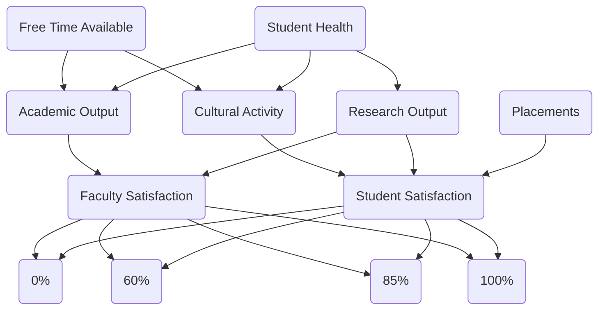

​                                                                                                                                                                                                        

| Abbreviation | Node                 | Values                |
| ------------ | -------------------- | --------------------- |
| HH           | Student Health       | Good, Bad             |
| FT           | Free Time Available  | Less, Adequate, Extra |
| AO           | Academic Output      | Good, Poor            |
| RO           | Research Output      | Good, Decent          |
| CA           | Cultural Activity    | High, Low             |
| PP           | Placements           | High, Very High       |
| FS           | Faculty Satisfaction | Happy, Unhappy        |
| SS           | Student Satisfaction | Happy, Unhappy        |
| OA           | 0% Attendance        | Yes, No               |
| OB           | 60% Attendance       | Yes, No               |
| OC           | 85% Attendance       | Yes, No               |
| OD           | 100% Attendance      | Yes, No               |
